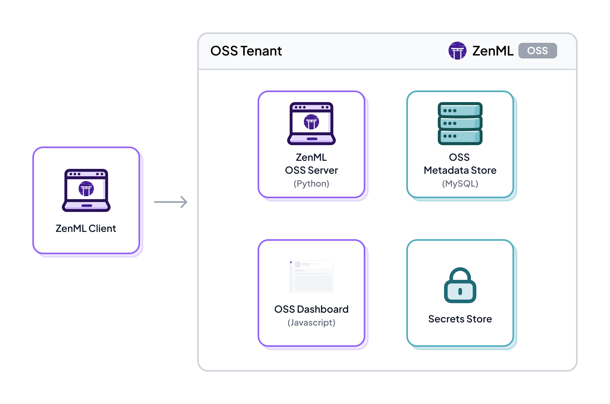
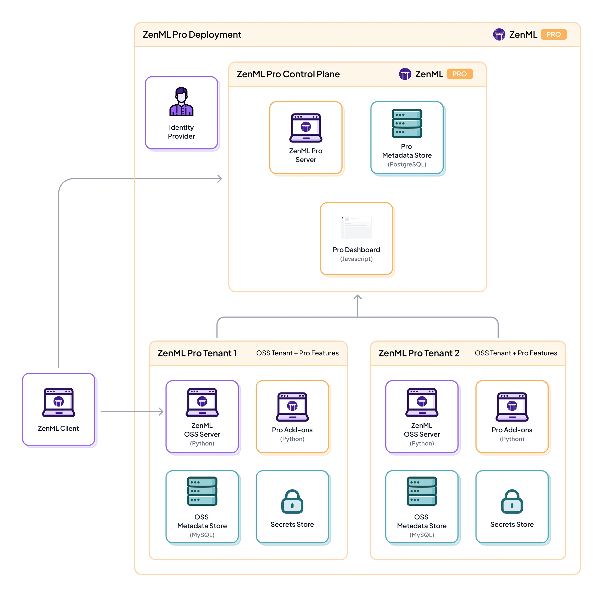
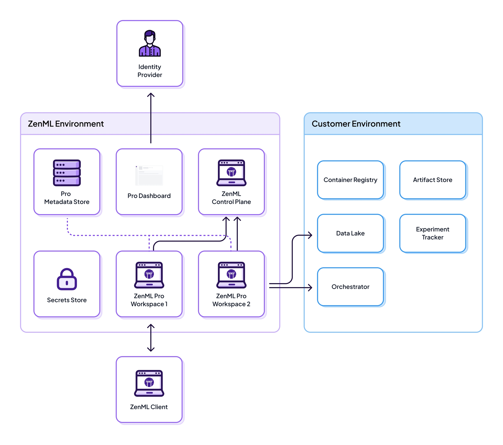
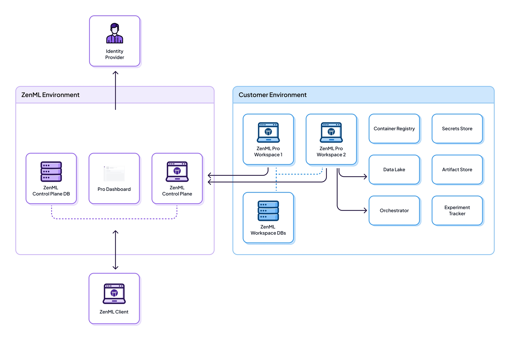
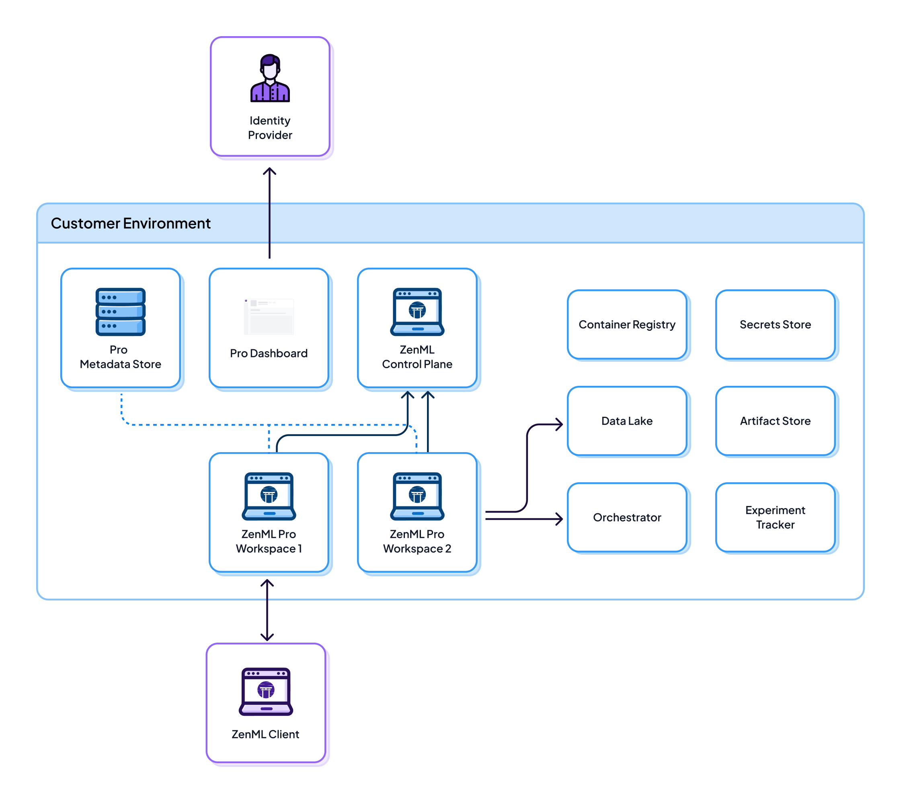

# **ZenML OSS vs ZenML Pro System Architecture**

> I asked ChatGPT Deep Research to explain me ZenML OSS & Pro Architecture with a focus on Kubernetes.

ZenML is an MLOps framework built on a **client-server architecture** that acts as a metadata layer on top of existing infrastructure. In both the Open Source (OSS) and Pro editions, all your data and compute remain in your infrastructure (cloud, on-premises, or Kubernetes) while ZenML manages metadata about pipelines, models, and workflows. Below, we break down the architectures of ZenML OSS and ZenML Pro in depth, including their components, deployment details (with a focus on Kubernetes), and key differences in features, scalability, and integrations.

## **ZenML Open Source (OSS) Architecture**

ZenML OSS follows a straightforward single-tenant architecture consisting of a few core components that you deploy and manage yourself. At a high level, an OSS deployment includes a **ZenML Client**, a **ZenML Server**, a **metadata database**, a **web dashboard**, and an optional **secrets store**.

The ZenML client (a Python SDK/CLI that lives in your development environment) communicates with the ZenML server to record and retrieve metadata, while actual ML workloads run on your chosen infrastructure (e.g., on a Kubernetes cluster, cloud VMs, or other orchestrators) outside the ZenML server.

**ZenML OSS server deployment architecture:**

In the OSS setup,
* a ZenML **Client** (e.g., your code or CLI on a developer machine) connects to a central **ZenML OSS Server** (a FastAPI-based application) to log and query metadata about pipeline runs, artifacts, stack components, etc.

* The server persists this metadata in an **OSS Metadata Store** (typically a MySQL database for production deployments, or SQLite for local experiments).

* The OSS Server usually also serves a lightweight **Dashboard** (a React.js web UI) for visualizing pipelines, runs, and artifacts. 

* Additionally, ZenML can integrate with a **Secrets Store** to securely hold credentials needed for your ML stacks (for example, cloud keys or model registry tokens).

* All these components are under the user's control in OSS, and no data or metadata leaves your infrastructure.

**Pipeline execution workflow:**

* In OSS, you typically trigger pipeline runs via the ZenML SDK/CLI on the client side.

* The ZenML client uses your configured **stack** (which may include an orchestrator like Apache Airflow, Kubernetes, or a simple local runner) to execute the pipeline steps on your infrastructure.

* The ZenML server’s role is to track metadata (pipelines, steps, metrics, artifact locations, etc.) and manage stack configurations, not to perform heavy computation itself.

* For example, if you use a Kubernetes orchestrator, the actual workload (e.g., training a model) runs as Kubernetes jobs in your cluster, while the ZenML server records the inputs/outputs and status of those jobs via its metadata API.

* This design ensures ZenML is largely **stateless** in terms of compute — it’s a control plane for metadata and orchestration, while data and compute live in external systems.

* The benefit is that **ZenML doesn’t copy or store your datasets or models**; it references them in an artifact store that you configure (such as an S3 bucket, GCS, or a data lake), and integrates with experiment trackers or model registries of your choice as part of your stack.

**Deployment modes (OSS):**

You can deploy the ZenML OSS server in various ways depending on your needs:

- **Local Deployment:**
  - For initial experimentation or development, you can run everything on a single machine (e.g., your laptop).
  - In this mode, the ZenML client, server, and database all run locally (by default using a simple SQLite database).
  - This requires virtually no setup and lets a single user quickly get started with building pipelines.

- **Self-Hosted Server:**

  * For team collaboration or production use, ZenML OSS can be deployed as a central server that multiple developers/clients connect to.

  * In this setup, you would run the ZenML server on a host (or VM/Container) and use a more robust external database (commonly MySQL) to store metadata for reliability.

  * The web dashboard is served along with the server, allowing users to inspect runs via a browser.

  * Since OSS doesn’t natively handle multiple distinct user accounts, teams often share this single workspace/server, and you’d rely on external means for authentication (e.g., network security or a reverse proxy) if needed.

  * All secrets and credentials can be managed via ZenML’s secrets manager component, which in OSS might simply store secrets in the MySQL database or an external vault under your control.

- **Kubernetes Deployment:**

  - ZenML OSS is fully containerized and can be deployed on a Kubernetes cluster for scalability and easier management. The ZenML project provides **Helm charts** to deploy the OSS server and its dependencies on K8s for a production-ready setup.

  - In a Kubernetes deployment, you might run the ZenML server as a Deployment (with one or more replicas behind a Service or Ingress), use a managed MySQL instance or MySQL container for the metadata store, and optionally use K8s Secrets or HashiCorp Vault as the secrets store.

  - This approach allows you to leverage Kubernetes features for reliability (e.g., auto-restart, scaling, backup of PVCs for the DB) and to integrate with cloud services.

  - For example, you can configure an Ingress with TLS to expose the ZenML dashboard securely, and use cloud storage (S3, GCS) as your artifact store which ZenML will interface with.
  - Notably, the ZenML server itself is stateless (all state in the database), so it can be scaled horizontally behind a load balancer if needed for read-heavy scenarios, although most OSS use-cases have a single server instance.

  - The **limit in OSS is mainly organizational, not technical** – without built-in multi-user isolation or role-based access control, all clients share the same workspace and have equal privileges.

## **ZenML Pro Architecture**

ZenML Pro builds on the OSS foundation to support **enterprise-grade features** like multi-user collaboration, workspace isolation, and governance controls.

The Pro architecture introduces a **multi-tenant system**: instead of a single OSS server, you get a **ZenML Control Plane** plus multiple **workspace servers** (which are essentially OSS servers augmented with Pro functionality).

The control plane and workspaces work together to provide a unified platform for large teams. Importantly, **ZenML Pro still uses the same core engine as OSS for running pipelines** – meaning your existing pipelines don’t need rewriting when upgrading – but it adds layers for security, scaling, and convenience features on top.

**ZenML Pro multi-tenant architecture:**

- In ZenML Pro, a centralized **Pro Control Plane** coordinates across all workspaces (tenants).

- The control plane consists of a **ZenML Pro Server** (managing global entities), a **Pro Metadata Store** (a PostgreSQL database for storing Pro-specific metadata like user accounts, roles, teams, and workspace definitions), and the **Pro Dashboard** (an advanced web application for the UI).

- Each team or project gets its own **Workspace**, which is essentially an isolated ZenML OSS server instance with added Pro **add-on modules** enabled.

- Each workspace (often referred to as a “workspace server” or tenant) has its own **OSS Metadata Store** (commonly MySQL, storing that workspace’s pipelines, runs, artifacts, etc.) and its own **Secrets Store** for sensitive credentials.
  - The Pro add-ons (Python modules running alongside the OSS server code) extend the workspace’s capabilities – for example, enforcing role-based access, enabling pipeline triggers, and integrating with the Pro control plane services.

- An external **Identity Provider** (IdP) is integrated with the control plane to handle user authentication and single sign-on.
  - In the ZenML Pro SaaS offering, the IdP is provided by ZenML (e.g., via Auth0 for social or corporate login),
  - whereas in self-hosted Pro, you can plug in your own OIDC-compliant IdP for SSO (allowing enterprise users to log in with their corporate credentials).

**Multi-workspace (multi-tenant) design:**

- Under ZenML Pro, what was a single OSS server becomes one **workspace** – and you can have many workspaces, each logically equivalent to an independent ZenML OSS deployment.

- The control plane knows about all workspaces and manages cross-cutting concerns like user management, organization hierarchy, and global configuration.

- This means teams can collaborate within a workspace (seeing the same pipelines and artifacts) but be isolated from other teams’ work in different workspaces.

- The control plane enforces **role-based access control (RBAC)** across all these workspaces, so that users only see and operate on the projects they’re permitted to.

- In practice, when a user logs into ZenML Pro, the control plane authenticates them via the IdP, then authorizes their actions (e.g., which workspace they can access, what operations they can perform) according to roles/permissions defined centrally.
  - Each workspace server then handles the actual pipeline orchestration and metadata for that team’s pipelines, just like an OSS server would, but it will consult the central services for any Pro-specific features or checks (for example, verifying if a user has permission to run a pipeline in that workspace).

**Enhanced UI and control plane features:**

- One of the most visible differences in Pro is the **ZenML Dashboard** (often called the “Pro UI”), which is a richer web application compared to the basic OSS dashboard.

- The Pro dashboard connects to the control plane and workspaces to provide views like a **Model Control Plane and Artifact Store UI**, comparisons of pipeline runs, and administrative interfaces.

- For instance, the Pro UI includes pages to list and compare all your registered models or datasets across pipeline runs, something not available in OSS.

- It also allows triggering pipelines, managing stack components, and setting up **triggers or run schedules** through a graphical interface. This is a step up from OSS, where you must use the CLI/SDK for these actions and have no built-in scheduling.

**Pipeline execution and Workload Manager:**

- In ZenML Pro, you gain the ability to **run pipelines directly from the server/UI** (rather than only from a user’s local CLI).

- Behind the scenes, ZenML employs a **Workload Manager** service to facilitate this. The workload manager is an internal component that can schedule and launch pipeline runs on your infrastructure in response to user actions or triggers from the control plane.

  - For example, if you click “Run Pipeline” in the Pro dashboard or configure a nightly schedule, the control plane delegates this to the workload manager, which might spawn a job (e.g., a Kubernetes Job or another orchestrator run) to execute the pipeline in the appropriate environment.
  
  - In a Kubernetes-based deployment, enabling this feature means setting up the capability for the workspace to launch ephemeral runner pods/jobs—ZenML provides Helm chart configurations to set up the necessary K8s service accounts and namespaces for these runner jobs. 
  
  - This mechanism (sometimes referred to as **“Pipeline Snapshots”** or run templates in ZenML Pro) ensures that even if no developer is manually running the code, the platform can orchestrate pipeline runs (for CI/CD automation, periodic retraining, or pipeline triggers on events) in a controlled, auditable way.
  
- The workload manager is optional and can be enabled when you need server-side execution of pipelines; otherwise, ZenML Pro can still be used with the traditional client-driven execution model.

**Deployment options (Pro):**

ZenML Pro supports flexible deployment models to accommodate enterprise needs:

- **Fully Managed SaaS:**

    

  - The quickest way to use ZenML Pro is via the hosted SaaS control plane. In this scenario, ZenML (the company) hosts the control plane services (including the web UI, central database, and authentication) in their cloud, and can also host the workspace servers for you in a multi-tenant cloud environment.
  
  - **Only metadata and credentials are stored on ZenML’s cloud**, while all actual ML artifacts (data, models, etc.) remain on the customer’s infrastructure (e.g., your own cloud storage).
  
  - When pipelines run, any heavy data stays in your configured artifact stores and orchestration backends; ZenML’s cloud only sees the metadata (like pipeline statuses, parameters, metrics) and possibly model files if you choose to upload them for the model registry UI.
  
  - This model is very low-overhead for the user (no infrastructure to manage) and ZenML ensures things like database backups, uptime, and updates of the control plane are handled for you.
  
  - The trade-off is that some metadata (pipeline/run metadata and optionally secrets) is in a third-party cloud – if that’s a concern, ZenML offers other modes.

- **Hybrid (Self-Hosted Workspaces + ZenML Cloud Control Plane):**

    

  - This deployment splits the responsibilities: ZenML Cloud hosts the control plane (auth, user management, global config) but **you deploy the workspace servers and their databases on your own infrastructure**.
  
  - In this “hybrid SaaS” model, your actual pipeline data and metadata never leave your environment – each workspace (with its MySQL metadata store and artifact stores, etc.) is fully on your cloud or Kubernetes cluster – but you still rely on the ZenML-hosted control plane for things like centralized authentication and RBAC logic.
  
  - The workspace servers communicate with the control plane over the network (typically outbound connections from your environment to the cloud), which allows the control plane to coordinate and know about the workspaces.
  
  - This setup is used when organizations want to keep all pipeline data in-house for compliance, yet avoid managing the complexity of a full control plane.
  
    - It requires setting up connections (often VPN or VPC peering) so that the cloud control plane can securely interact with on-prem or VPC-hosted workspaces, usually through egress-only connections for security.
  
  - ZenML notes this provides a balance: you maintain **data sovereignty** and control over compute, while offloading user management and some maintenance to the SaaS control plane.

- **Fully Self-Hosted (Air-Gapped):**

    

  - For organizations with the strictest security requirements, ZenML Pro can be deployed completely on-premises or in your private cloud, with **no external dependencies**.

  - In this mode, you run the ZenML Pro control plane services and all workspace servers yourself (typically in your Kubernetes cluster or VMs).
  
    - All data—metadata, secrets, models, etc.—stays within your network boundary, and you can even operate in an air-gapped environment (no internet access) if needed.
  
    - ZenML provides container images and Helm charts for the control plane and workspaces to facilitate this deployment on Kubernetes.
  
  - A self-hosted Pro deployment will require you to set up a PostgreSQL instance for the control plane metadata, one MySQL (or cluster of MySQL) for each workspace’s metadata, and possibly an internal container registry if the environment is air-gapped (to host the ZenML Docker images).
  
  - You’d also configure an identity provider (OIDC) for user auth, or ZenML can be configured to use a built-in Auth0 tenant if internet connectivity is available.
  
  - While this option gives maximum control and isolation (ZenML has **no access to any of your data** in this setup), it also means you are responsible for all maintenance such as scaling services, applying upgrades/patches, and ensuring high availability.
  
  - To aid with this, ZenML’s Helm charts let you deploy the control plane and workspace servers with production settings (e.g. behind ingress with TLS, using PersistentVolumes for databases, etc.), and ZenML offers support services for Pro customers to assist with these deployments.

**Scalability and performance:**

The Pro architecture is designed to scale with your teams and workloads.

* Because each workspace has its own backend, heavy pipeline metadata I/O is sharded by workspace (preventing one team’s pipelines from overloading the database for another).

* Workspaces can be added or scaled horizontally as needed – for example, you might run multiple instances of a workspace server behind a load balancer to handle a high volume of API requests or UI traffic for that team, while another small team’s workspace might run with a single instance. The control plane itself can also be scaled (it’s a stateless service fronting the Postgres DB), allowing the system to handle many simultaneous users and workspaces.

* ZenML has introduced performance optimizations in recent releases to handle larger metadata volumes and high-throughput scenarios (caching, optimized queries, etc.), benefiting both OSS and Pro deployments.

* Additionally, Pro provides enterprise features like **database backups, point-in-time rollbacks, and monitoring** for the control plane when managed by ZenML, which contribute to reliability at scale.

* From an integration standpoint, Pro can handle more complex setups – for example, integrating with enterprise data catalogs or CI/CD systems via webhooks and custom triggers (a Pro feature is the ability to define **event triggers** that respond to external events to kick off pipelines). This means ZenML Pro can sit at the center of a production ML platform, connecting all the pieces (data sources, training compute, model registry, monitoring) with governance around it.

## Key Feature and Architecture Differences

To summarize the differences between ZenML OSS and ZenML Pro architectures, here are some key points related to features, scalability, and integrations:

- **Multi-User Collaboration:**
  - **OSS** is essentially single-user (no built-in concept of multiple users or workspaces – everyone shares the same context with full access).
  
  - **Pro** introduces multi-user support with **Organizations**, **Workspaces**, and **Teams** to isolate projects and data.
  
  - Users log in via SSO in Pro and are subject to **Role-Based Access Control (RBAC)**, whereas OSS has no RBAC or user roles at the server level. This means in Pro you can enforce fine-grained permissions (e.g., who can approve a model deployment or edit a stack) which is crucial for enterprise governance.

- **Dashboard and UX:**
  - The **OSS dashboard** provides basic views of pipeline runs and metadata, but it’s minimal.
  
  - **ZenML Pro’s web UI** is far more advanced – it includes a **Model Control Plane** and **Artifact Catalog** for inspecting all models/artifacts, comparison tools for pipeline runs, and UI workflows to deploy models or trigger pipelines.
  
  - For example, in Pro you can directly promote a model to production or evaluate drift via the GUI, whereas OSS might require manual scripting or external tools for such tasks.

- **Pipeline Execution & Automation:**
  - In **OSS**, pipelines can only be started via code/CLI by a user.
  
  - **Pro** allows pipelines to be executed from the UI or via a REST API call to the control plane, enabling one-click re-runs and continuous integration triggers.
  
  - The Pro control plane, in conjunction with the **Workload Manager**, can schedule pipelines (e.g., cron jobs) or respond to triggers (like a new data arrival or a Git commit) automatically. This is a huge advantage for building automated retraining workflows and CI/CD for ML. OSS users would have to rely on external schedulers or scripts to achieve similar automation, since ZenML OSS has no built-in scheduler or trigger mechanism.

- **Container & Environment Management:**
  - Both OSS and Pro rely on containerization for running pipelines on remote infrastructure (each pipeline run can be containerized for consistency).
  
  - **OSS** provides basic container management – it will build a container image for your pipeline if needed and run it on the orchestrator, but it doesn’t optimize across runs.
  
  - **Pro** includes **advanced container reuse and optimization**. This means Pro can cache and reuse pipeline images between runs or even share them across similar runs, reducing overhead when you re-run pipelines frequently. This feature improves efficiency in production where pipelines are often repeated.

- **Integrations and Connectors:**
  - ZenML integrates with many external MLOps tools (for experiment tracking, model serving, data validation, etc.) via its **stack components** in both OSS and Pro. The difference is in **how you manage credentials and integration configs**.
  
  - In OSS, setting up integration (say connecting to MLflow or S3) is done via code/CLI and requires manually handling credentials (often using environment variables or a secrets manager).
  
  - In Pro, there is a **Service Connector** interface with a UI, where you can centrally store credentials and configure integrations through the dashboard. The Pro dashboard provides a convenient way to add cloud credentials or third-party API keys and share them securely across your team, backed by the secrets store.
  
  - Moreover, Pro might offer **official integrations** (validated, with enterprise support) for certain tools whereas OSS relies on community contributions for integration plugins.
  
  - Both editions keep actual data in external systems (for example, your model artifact lives in an artifact store like S3, and ZenML just tracks a reference to it), but Pro makes it easier to orchestrate complex flows across these systems with features like **webhook triggers, CI/CD pipeline templates, and built-in notifications**.

- **Scalability and Maintenance:**
  - **OSS** is self-managed – you are responsible for deploying the server, scaling it, upgrading it, and maintaining the database. Scaling OSS might involve setting up a MySQL cluster or vertical scaling on the server if you hit performance limits.
  
  - **Pro** (especially SaaS) offloads much of this: the managed control plane comes with automated upgrades, performance optimizations, and **24/7 support** for enterprise customers.
  
  - Even in self-hosted Pro, ZenML provides enterprise support and guidance (including **specialized onboarding** to design your MLOps infrastructure) which is not available for OSS users.
  
  - The Pro architecture, with its separation of concerns (multiple databases, microservices for control plane vs. workspaces), is inherently more scalable for growing teams.
  
  - It also supports **backup and restore** out of the box for the metadata stores and has been hardened for reliability (e.g., ZenML’s cloud offering is SOC 2 and ISO 27001 certified for security, reflecting the production-readiness of the Pro platform).

In summary, **ZenML Pro extends the robust core of ZenML OSS with a suite of additional services and features geared towards collaboration, governance, and scale**. The OSS version is ideal for individuals or small teams getting started with pipeline-based ML workflows, giving full control over data and execution at the cost of manual management.

The Pro version introduces a layered architecture (control plane + workspaces) that addresses the needs of larger organizations: multi-user support, secure and isolated workspaces, a richer user interface, and the ability to deploy and manage the system in flexible ways (from fully-managed SaaS to fully self-hosted on Kubernetes).

Both share the principle of being a **unified MLOps orchestration layer** that sits on top of your existing tools/infrastructure – but Pro provides the **enterprise “glue”** to tie those pieces together with security, automation, and reliability. And because ZenML Pro was designed as an **upgrade on top of OSS**, you can start with the OSS deployment and later migrate to Pro without refactoring your pipelines or moving your metadata – the architectures are compatible by design, ensuring a smooth transition when your MLOps needs grow.

**Sources:**

ZenML Documentation:

- [*System Architecture (OSS vs Pro)*](https://docs.zenml.io/getting-started/system-architectures)
- [*ZenML Pro Introduction & Feature Comparison*](https://docs.zenml.io/pro)
- [*Deployments and Kubernetes Deployment Guides*](https://docs.zenml.io/pro/deployments/scenarios/self-hosted-deployment/self-hosted-deployment-helm)
- [*Open Source vs Pro Feature Breakdown*](https://www.zenml.io/open-source-vs-pro)
- [*ZenML Architecture & Deployment Options*](https://docs.zenml.io/deploying-zenml/deploying-zenml)
